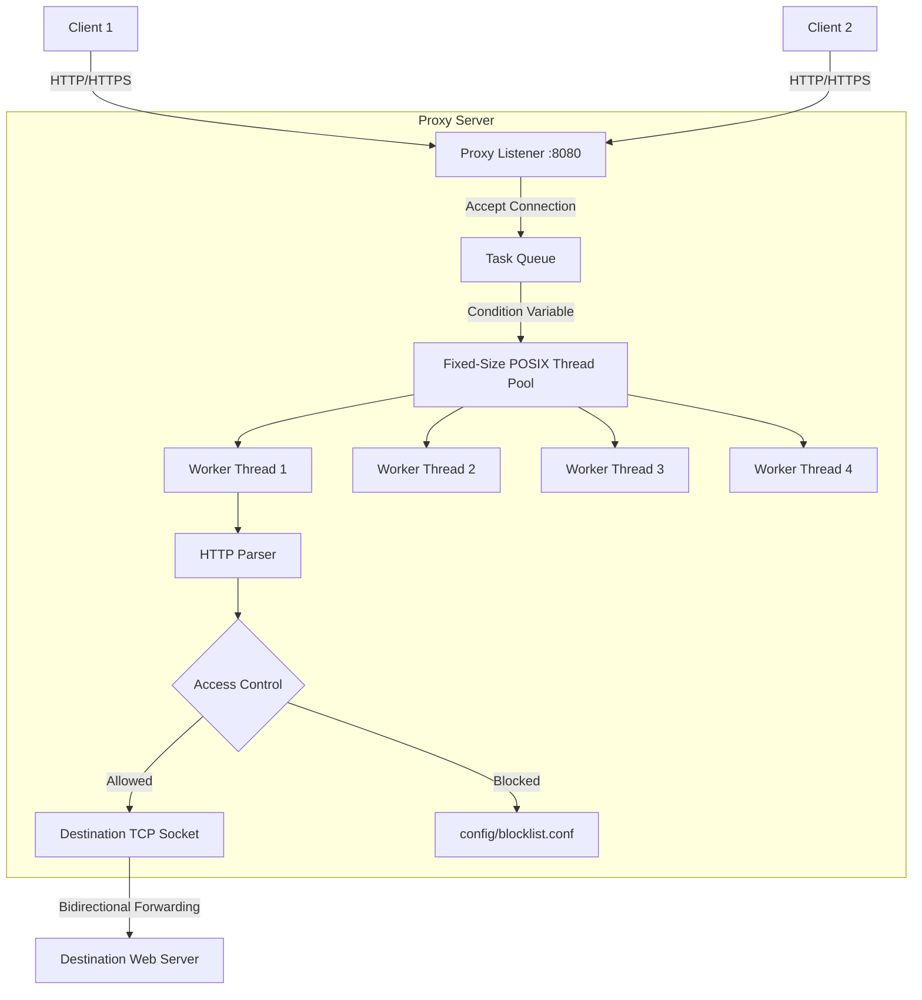

# Multithreaded C++ Proxy Server

A lightweight, high-performance HTTP/HTTPS proxy server written in C++17 from scratch. This project was built to demonstrate a deep understanding of POSIX systems programming, multithreading, and low-level TCP/IP networking without relying on heavy external frameworks like Boost.Asio.

## Project Overview
This proxy server sits between a client (like a web browser or `curl`) and a destination server. It accepts incoming TCP connections, parses the HTTP requests to determine the destination, establishes an outbound connection, and safely forwards raw bytes back and forth. 

It supports both standard HTTP proxying and secure HTTPS tunneling via the `CONNECT` method, and is protected by a thread-safe custom firewall ruleset.

## Architecture



## How It Works

### HTTP Proxying
When a client sends a standard HTTP request (e.g., `GET http://example.com/`), the proxy parses the first line and the `Host` header to extract the target domain and port. It then establishes a standard TCP connection to the destination, forwards the unencrypted HTTP request, and forwards the HTML response back to the client.

### HTTPS CONNECT Tunneling
Because HTTPS traffic is end-to-end encrypted via TLS, the proxy cannot read the URL path or modify the request. Instead, the client sends an unencrypted HTTP `CONNECT` request to the proxy (e.g., `CONNECT google.com:443`). 
The proxy establishes a TCP connection to the destination and replies to the client with `HTTP/1.1 200 Connection Established`. From that moment on, the proxy acts as a "blind tunnel", utilizing the POSIX `poll()` function to bidirectionally forward encrypted raw bytes between the client and the destination until the connection is closed.

### Thread Pool Architecture
To handle dozens of concurrent clients without crashing, the proxy uses a fixed-size POSIX thread pool (default 4 workers). 
When the main thread accepts a new client connection, it packages the socket descriptor into a task and pushes it to a `std::queue`. The queue is protected by a `pthread_mutex_t` to prevent race conditions. If the queue is empty, worker threads sleep using a `pthread_cond_t` (condition variable). When a new task arrives, the main thread signals the condition variable, waking up exactly one worker to handle the client.

### Access-Control Firewall
The proxy includes a lightweight filtering engine that evaluates every parsed request against `config/blocklist.conf`. It can block traffic based on:
* Destination Hostname (`BLOCK_HOST testsite.com`)
* HTTP Method (`BLOCK_METHOD POST`)

If a request is blocked, the proxy immediately returns a custom `403 Forbidden` HTML page and drops the connection before ever reaching out to the destination server.

## Build Instructions (Linux / WSL)

This project uses CMake and requires a Linux environment (or WSL on Windows) due to its use of POSIX sockets.

```bash
# Clone the repository and enter the directory
mkdir build
cd build
cmake -DCMAKE_BUILD_TYPE=Release ..
make
```

## Configuration
Edit `config/blocklist.conf` to add or remove firewall rules. 
```text
BLOCK_HOST badsite.com
BLOCK_METHOD POST
```

## Testing Instructions

**1. Start the server:**
```bash
./proxy_server
```

**2. Test HTTP (Allowed):**
```bash
curl -v -x http://127.0.0.1:8080 http://example.com/
```

**3. Test HTTPS Tunneling (Allowed):**
```bash
curl -v -x http://127.0.0.1:8080 https://google.com/
```

**4. Test Blocklist:**
```bash
# Assuming testsite.com is in blocklist.conf
curl -x http://127.0.0.1:8080 http://testsite.com/
```

## Debugging and Optimization

### GDB Debugging Case Study
During development, GDB was used to inspect socket states and thread synchronization. For example, to verify that the client IP was being correctly extracted before being passed to the worker thread:
1. Compiled with `-DCMAKE_BUILD_TYPE=Debug`
2. Ran `gdb ./proxy_server`
3. Set a breakpoint: `break Server::handle_client`
4. Triggered a curl request, freezing the proxy mid-execution.
5. Inspected local variables safely: `print client_ip` which returned exactly `"127.0.0.1"`.

### Valgrind Memory Testing
Because C++ requires manual memory management, the proxy was heavily profiled using Valgrind to ensure zero memory leaks during infinite server loops.
```bash
valgrind --leak-check=full --track-origins=yes ./proxy_server
```
**Result:** `All heap blocks were freed -- no leaks are possible`

### Concurrent Stress Testing
The thread pool was stress-tested using `ApacheBench` (`ab`) to ensure the mutex locks and condition variables functioned correctly under heavy load.

**Test Methodology:** 100 total requests simulating 10 concurrent users.
```bash
ab -X 127.0.0.1:8080 -n 100 -c 10 http://example.com/
```

**Results:**
* **Failed Requests:** 0
* **Concurrency Level:** 10
* **Requests per second:** 8.80 [#/sec]
*(Note: RPS was bottlenecked by external internet latency to example.com (1000ms+ round trips), not proxy CPU overhead. The proxy successfully maintained 100% stability).*

## Known Limitations
* Does not support SOCKS5 protocol.
* Does not intercept or decrypt TLS (HTTPS) traffic (functions only as a blind tunnel).
* Logging is currently written synchronously via mutex lock, which could theoretically bottleneck throughput at >10,000 RPS.

## Future Improvements
* Migrate from 1-thread-per-client to an Event-Driven architecture using `epoll` for massive concurrency scaling.
* Implement a persistent caching layer for standard HTTP GET requests.
* Add connection keep-alive support to reuse sockets between the proxy and destination.
